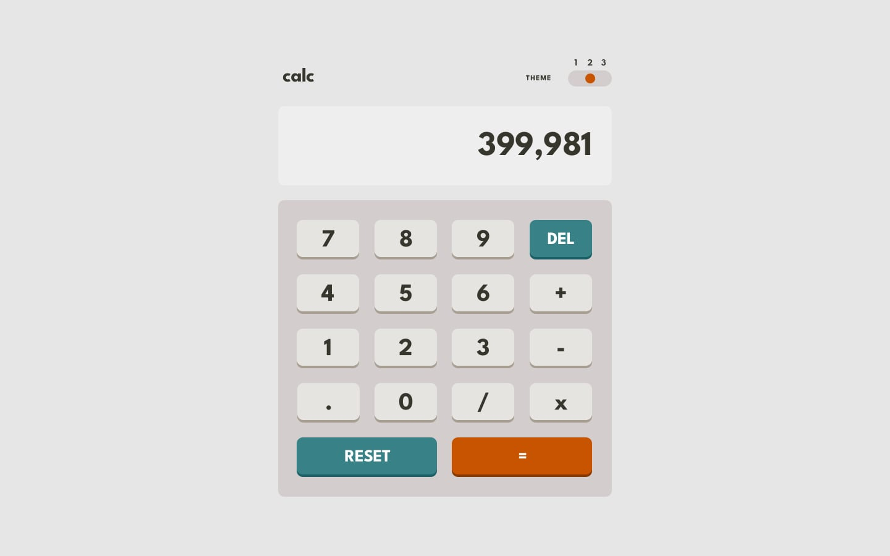

<h1 align="center">🧮 Themed Calculator App</h1>

  A sleek, responsive calculator with multiple themes and sound effects built using <b>HTML, CSS, and JavaScript</b>.

  
  
  

---

## 📸 Preview

  

  

  

---

## 🚀 Features

- 🎨 **Multiple Themes** – Switch between Light, Dark, Neon.
- 🔊 **Sound Effects** – Clicks & feedback sounds for keys.
- 📱 **Responsive Design** – Mobile & desktop compatible.
- 🧠 **Basic Math Operations** – Add, Subtract, Multiply, Divide.
- 🧹 **Clear & Delete** buttons.
- 💾 **Smooth UI transitions**.

more features coming soon

---

## 🛠️ Tech Stack

- HTML5  
- CSS3 (Flexbox + Grid)  
- JavaScript (DOM manipulation, logic handling)
- Netlify (Deployment)  

---

## 🎮 Demo

👉 [Live Demo on Netlify]()

---

Feel free to fork and use.

